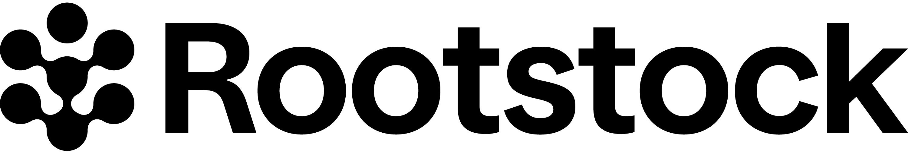
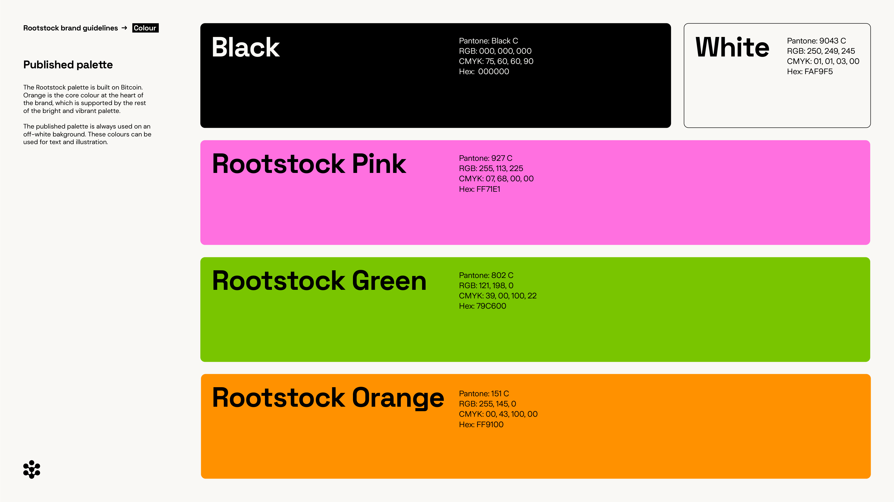
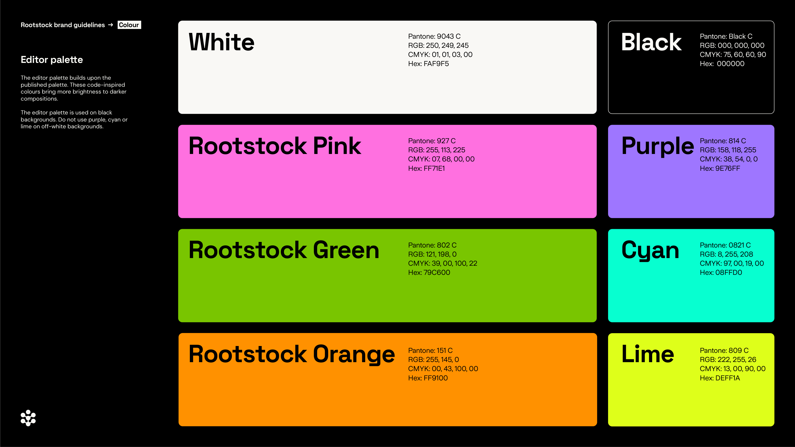
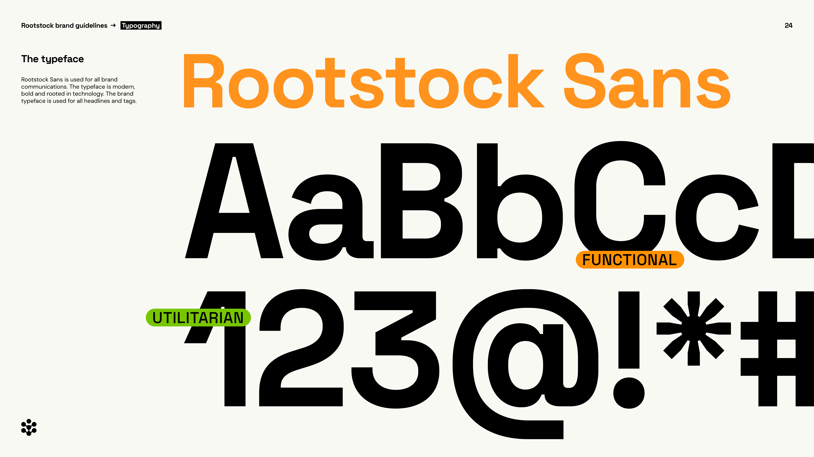
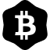

# Rootstock Brand System

Official brand assets for Rootstock, Bitcoin's financial infrastructure. Rootstock is the most secure and longest-running smart contract sidechain cryptographically and economically connected to Bitcoin the network and BTC the asset. 

Brand color: `#FF9100` · Website: [rootstock.io](https://rootstock.io) X: [@rootstock_io](https://x.com/rootstock_io))

---

## Logo System

### Logomark

| Preview | Name | Download |
|---------|------|----------|
|  | Rootstock Logomark (Colour) | [SVG](logos/svg/logomark/Rootstock_Logomark_Colour.svg) · [PNG](logos/png/logomark/Rootstock_Logomark_Colour.png) |
|  | Rootstock Logomark (Black) | [SVG](logos/svg/logomark/Rootstock_Logomark_Black.svg) · [PNG](logos/png/logomark/Rootstock_Logomark_Black.png) |
|  | Rootstock Logomark (White) | [SVG](logos/svg/logomark/Rootstock_Logomark_White.svg) · [PNG](logos/png/logomark/Rootstock_Logomark_White.png) |

### Lock-up (Logomark + Wordmark)

| Preview | Name | Download |
|---------|------|----------|
|  | Rootstock Lock-up (Colour) | [SVG](logos/svg/lockup/Rootstock_Lockup_Colour.svg) · [PNG](logos/png/lockup/Rootstock_Lockup_Colour.png) |
|  | Rootstock Lock-up (Black) | [SVG](logos/svg/lockup/Rootstock_Lockup_Black.svg) · [PNG](logos/png/lockup/Rootstock_Lockup_Black.png) |
|  | Rootstock Lock-up (White) | [SVG](logos/svg/lockup/Rootstock_Lockup_White.svg) · [PNG](logos/png/lockup/Rootstock_Lockup_White.png) |

---

## Color Palette

### Published Palette
Used on off-white backgrounds. Orange is the core brand color.

[](public/Rootstock_Colour_Published.png)

| Swatch | Name | Hex | RGB | Pantone |
|--------|------|-----|-----|---------|
|  | Black | `#000000` | 0, 0, 0 | Black C |
|  | White | `#FAF9F5` | 250, 249, 245 | 9043 C |
|  | Rootstock Pink | `#FF71E1` | 255, 113, 225 | 927 C |
|  | Rootstock Green | `#79C600` | 121, 198, 0 | 802 C |
|  | Rootstock Orange | `#FF9100` | 255, 145, 0 | 151 C |

### Editor Palette
Used on black backgrounds. Do not use Purple, Cyan, or Lime on off-white backgrounds.

[](public/Rootstock_Colour_Editor.png)

| Swatch | Name | Hex | RGB | Pantone |
|--------|------|-----|-----|---------|
|  | White | `#FAF9F5` | 250, 249, 245 | 9043 C |
|  | Black | `#000000` | 0, 0, 0 | Black C |
|  | Rootstock Pink | `#FF71E1` | 255, 113, 225 | 927 C |
|  | Purple | `#9E76FF` | 158, 118, 255 | 814 C |
|  | Rootstock Green | `#79C600` | 121, 198, 0 | 802 C |
|  | Cyan | `#08FFD0` | 8, 255, 208 | 0821 C |
|  | Rootstock Orange | `#FF9100` | 255, 145, 0 | 151 C |
|  | Lime | `#DEFF1A` | 222, 255, 26 | 809 C |

> For full usage rules see the [Brand Guidelines PDF](public/Rootstock_Brand_Guidelines.pdf).

---

## Typography System

Rootstock uses a custom typeface family: **Rootstock Sans**, available in three variants.

[](public/Rootstock_Typography_System.png)

| Font | Use Case | Download (OTF) | Download (Web) |
|------|----------|----------------|----------------|
| Rootstock Sans Headline | Display, headings, hero text | [OTF](fonts/otf/Rootstock-Sans-Headline.otf) | [WOFF](fonts/web/Rootstock-Sans-Headline.woff) · [WOFF2](fonts/web/Rootstock-Sans-Headline.woff2) |
| Rootstock Sans Body | Body copy, UI text | [OTF](fonts/otf/Rootstock-Sans-Body.otf) | [WOFF](fonts/web/Rootstock-Sans-Body.woff) · [WOFF2](fonts/web/Rootstock-Sans-Body.woff2) |
| Rootstock Sans Tags | Labels, tags, badges, captions | [OTF](fonts/otf/Rootstock-Sans-Tags.otf) | [WOFF](fonts/web/Rootstock-Sans-Tags.woff) · [WOFF2](fonts/web/Rootstock-Sans-Tags.woff2) |

### NPM Package

Install the official `@rootstock/fonts` package for use in Next.js, React, and Vue projects:

```bash
npm install @rootstock/fonts
# or
yarn add @rootstock/fonts
# or
bun add @rootstock/fonts
```

#### Basic CSS Import

```js
// app/layout.tsx or pages/_app.tsx
import '@rootstock/fonts';
```

#### Next.js App Router

```tsx
// app/layout.tsx
import { RootstockSansHeadline } from '@rootstock/fonts/font/headline';
import { RootstockSansBody } from '@rootstock/fonts/font/body';
import { RootstockSansTags } from '@rootstock/fonts/font/tags';

export default function RootLayout({ children }) {
  return (
    <html lang="en">
      <style jsx global>{`
        :root {
          --font-rootstock-headline: ${RootstockSansHeadline.style.fontFamily};
          --font-rootstock-body: ${RootstockSansBody.style.fontFamily};
          --font-rootstock-tags: ${RootstockSansTags.style.fontFamily};
        }
      `}</style>
      <body>{children}</body>
    </html>
  );
}
```

#### Tailwind Configuration

```js
// tailwind.config.js
module.exports = {
  presets: [require('@rootstock/fonts/tailwind')],
  content: ['./src/**/*.{js,ts,jsx,tsx}'],
};
```

This gives you:

```html
<h1 class="font-rootstock-headline text-rsk-h1 text-rootstock-orange">Hello</h1>
<p class="font-rootstock-body text-rsk-body">Body text</p>
<span class="font-rootstock-tags text-rsk-tag">Tag</span>
```

#### Raw CSS @font-face

```css
@font-face {
  font-family: 'Rootstock Sans Headline';
  src: url('node_modules/@rootstock/fonts/dist/fonts/Rootstock-Sans-Headline.woff2') format('woff2'),
       url('node_modules/@rootstock/fonts/dist/fonts/Rootstock-Sans-Headline.woff') format('woff');
  font-display: swap;
}

@font-face {
  font-family: 'Rootstock Sans Body';
  src: url('node_modules/@rootstock/fonts/dist/fonts/Rootstock-Sans-Body.woff2') format('woff2'),
       url('node_modules/@rootstock/fonts/dist/fonts/Rootstock-Sans-Body.woff') format('woff');
  font-display: swap;
}

@font-face {
  font-family: 'Rootstock Sans Tags';
  src: url('node_modules/@rootstock/fonts/dist/fonts/Rootstock-Sans-Tags.woff2') format('woff2'),
       url('node_modules/@rootstock/fonts/dist/fonts/Rootstock-Sans-Tags.woff') format('woff');
  font-display: swap;
}
```

---

## rBTC Token

rBTC is the native token of Rootstock, pegged 1:1 with Bitcoin.

### Logo (Symbol + Wordmark)

| Preview | Variant | SVG | PNG |
|---------|---------|-----|-----|
|  | Primary | [SVG](tokens/rBTC/SVG/Logo/rBTC_Logo_Primary.svg) | [16](tokens/rBTC/PNG/Logo/rBTC_Logo_Primary_16px.png) · [32](tokens/rBTC/PNG/Logo/rBTC_Logo_Primary_32px.png) · [64](tokens/rBTC/PNG/Logo/rBTC_Logo_Primary_64px.png) · [128](tokens/rBTC/PNG/Logo/rBTC_Logo_Primary_128px.png) · [256](tokens/rBTC/PNG/Logo/rBTC_Logo_Primary_256px.png) · [512](tokens/rBTC/PNG/Logo/rBTC_Logo_Primary_512px.png) |
|  | Inverted | [SVG](tokens/rBTC/SVG/Logo/rBTC_Logo_Inverted.svg) | [16](tokens/rBTC/PNG/Logo/rBTC_Logo_Inverted_16px.png) · [32](tokens/rBTC/PNG/Logo/rBTC_Logo_Inverted_32px.png) · [64](tokens/rBTC/PNG/Logo/rBTC_Logo_Inverted_64px.png) · [128](tokens/rBTC/PNG/Logo/rBTC_Logo_Inverted_128px.png) · [256](tokens/rBTC/PNG/Logo/rBTC_Logo_Inverted_256px.png) · [512](tokens/rBTC/PNG/Logo/rBTC_Logo_Inverted_512px.png) |
|  | Light | [SVG](tokens/rBTC/SVG/Logo/rBTC_Logo_Light.svg) | [16](tokens/rBTC/PNG/Logo/rBTC_Logo_Light_16px.png) · [32](tokens/rBTC/PNG/Logo/rBTC_Logo_Light_32px.png) · [64](tokens/rBTC/PNG/Logo/rBTC_Logo_Light_64px.png) · [128](tokens/rBTC/PNG/Logo/rBTC_Logo_Light_128px.png) · [256](tokens/rBTC/PNG/Logo/rBTC_Logo_Light_256px.png) · [512](tokens/rBTC/PNG/Logo/rBTC_Logo_Light_512px.png) |
|  | Dark | [SVG](tokens/rBTC/SVG/Logo/rBTC_Logo_Dark.svg) | [16](tokens/rBTC/PNG/Logo/rBTC_Logo_Dark_16px.png) · [32](tokens/rBTC/PNG/Logo/rBTC_Logo_Dark_32px.png) · [64](tokens/rBTC/PNG/Logo/rBTC_Logo_Dark_64px.png) · [128](tokens/rBTC/PNG/Logo/rBTC_Logo_Dark_128px.png) · [256](tokens/rBTC/PNG/Logo/rBTC_Logo_Dark_256px.png) · [512](tokens/rBTC/PNG/Logo/rBTC_Logo_Dark_512px.png) |

### Symbol (Icon only)

| Preview | Variant | SVG | PNG |
|---------|---------|-----|-----|
|  | Primary | [SVG](tokens/rBTC/SVG/Symbol/rBTC_Symbol_Primary.svg) | [16](tokens/rBTC/PNG/Symbol/rBTC_Symbol_Primary_16px.png) · [32](tokens/rBTC/PNG/Symbol/rBTC_Symbol_Primary_32px.png) · [64](tokens/rBTC/PNG/Symbol/rBTC_Symbol_Primary_64px.png) · [128](tokens/rBTC/PNG/Symbol/rBTC_Symbol_Primary_128px.png) · [256](tokens/rBTC/PNG/Symbol/rBTC_Symbol_Primary_256px.png) · [512](tokens/rBTC/PNG/Symbol/rBTC_Symbol_Primary_512px.png) |
|  | Inverted | [SVG](tokens/rBTC/SVG/Symbol/rBTC_Symbol_Inverted.svg) | [16](tokens/rBTC/PNG/Symbol/rBTC_Symbol_Inverted_16px.png) · [32](tokens/rBTC/PNG/Symbol/rBTC_Symbol_Inverted_32px.png) · [64](tokens/rBTC/PNG/Symbol/rBTC_Symbol_Inverted_64px.png) · [128](tokens/rBTC/PNG/Symbol/rBTC_Symbol_Inverted_128px.png) · [256](tokens/rBTC/PNG/Symbol/rBTC_Symbol_Inverted_256px.png) · [512](tokens/rBTC/PNG/Symbol/rBTC_Symbol_Inverted_512px.png) |
|  | Light | [SVG](tokens/rBTC/SVG/Symbol/rBTC_Symbol_Light.svg) | [16](tokens/rBTC/PNG/Symbol/rBTC_Symbol_Light_16px.png) · [32](tokens/rBTC/PNG/Symbol/rBTC_Symbol_Light_32px.png) · [64](tokens/rBTC/PNG/Symbol/rBTC_Symbol_Light_64px.png) · [128](tokens/rBTC/PNG/Symbol/rBTC_Symbol_Light_128px.png) · [256](tokens/rBTC/PNG/Symbol/rBTC_Symbol_Light_256px.png) · [512](tokens/rBTC/PNG/Symbol/rBTC_Symbol_Light_512px.png) |
|  | Dark | [SVG](tokens/rBTC/SVG/Symbol/rBTC_Symbol_Dark.svg) | [16](tokens/rBTC/PNG/Symbol/rBTC_Symbol_Dark_16px.png) · [32](tokens/rBTC/PNG/Symbol/rBTC_Symbol_Dark_32px.png) · [64](tokens/rBTC/PNG/Symbol/rBTC_Symbol_Dark_64px.png) · [128](tokens/rBTC/PNG/Symbol/rBTC_Symbol_Dark_128px.png) · [256](tokens/rBTC/PNG/Symbol/rBTC_Symbol_Dark_256px.png) · [512](tokens/rBTC/PNG/Symbol/rBTC_Symbol_Dark_512px.png) |

---

## Brand Guidelines

The full brand guidelines document covers logo usage rules, color palette, typography scale, spacing, and do/don'ts.

[📄 Download Brand Guidelines PDF](public/Rootstock_Brand_Guidelines.pdf)

---

## Repository Layout

```
rootstock-brand-system/
├── logos/
│   ├── svg/
│   │   ├── lockup/          # Logomark + wordmark combinations (SVG)
│   │   └── logomark/        # Icon only (SVG)
│   └── png/
│       ├── lockup/          # Logomark + wordmark combinations (PNG)
│       └── logomark/        # Icon only (PNG)
├── fonts/
│   ├── otf/                 # Desktop fonts (OTF)
│   └── web/                 # Web fonts (WOFF, WOFF2)
├── dist/                    # npm package output
│   ├── css/                 # Compiled CSS with @font-face declarations
│   └── fonts/               # Web fonts for npm distribution
├── src/                     # npm package source
│   ├── font/                # Next.js localFont helpers
│   └── types/               # TypeScript definitions
├── tokens/
│   └── rBTC/                # rBTC token logos (SVG + PNG, 4 variants, 6 sizes)
│       ├── SVG/
│       │   ├── Logo/
│       │   └── Symbol/
│       └── PNG/
│           ├── Logo/
│           └── Symbol/
└── public/
    ├── Rootstock_Brand_Guidelines.pdf
    ├── Rootstock_Typography_System.png
    ├── Rootstock_Colour_Published.png
    └── Rootstock_Colour_Editor.png
```

---

## License

MIT License — see [LICENSE.md](LICENSE.md) for details.
